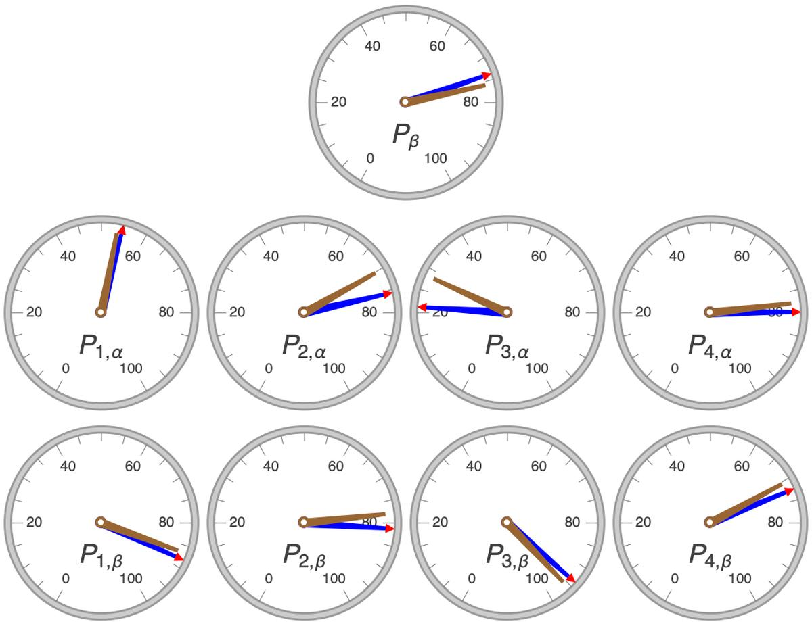

# A Call to Experimentation and Invention In Algebraic Evaluators of Noisy AI Judges

Who judges the judges? The problem of the authority of noisy judges when we ourselves don't know their correct answers is pervasive in society and technology. In AI it is exemplified by the Stanford HAI AI Audit Challenge. Our submission to the challenge is this open source repository
highlighting the technology behind our GroundSeer(tm) product.

The submission focuses on one aspect of the AI Audit Challenge - the ubiquity of black-box
noisy AI algorithms. How can we know that these algorithms are working correctly once
deployed? How can we have any assurance of their correctness without access to their internals
so we can audit them? We need to be able to monitor AI algorithms on the wild and we need
to do so robustly. GroundSeer(tm) points in one direction that can help us with this grand
challenge. Its 2010 patent is the world's first distribution-free evaluator of noisy AI
judges.

The safety engineer and the philosopher of science face the same "last mile verification" problem.
They must both evaluate noisy judges without the benefit of the ground truth. GroundSeer(tm)
is one way to mitigate this problem. The main app in this submission is MappingYourAIAlarm.nb.
It uses the same core mathematical technology as GroundSeer(tm). We think it can be taken
further. Our submission is also a call to the curious inventors of the World to explore this
mathematical core and take it in new directions. Anyone in the World curious about algebra and AI safety can explore with us.

All the code in this repository is written in Mathematica. This platform for the Wolfram Language is perfect for our task. Mathematica neatly integrates the data, programming, and algebraic aspects of this way of evaluating noisy AI judges. Anybody with access to a RaspberryPi can execute and experiment with this code. We hope they do.

The core of that exploration is an initial app -MappingYourAIAlarm.nb that shows one of the many advantages of distribution-free evaluators. They can alarm on their own failure. This makes them useful for AI safety. This use of algebraic, not real numbers, gives them an important edge over evaluators that use probability distributions. Using this app will help clarify the advantages and limitations of doing this.

GroundSeer(tm) and the MappingYourAIAlarm.nb app rely on the mathematics of Algebraic
Geometry. The explanation and demonstration of the core theorem used in this repository is
TheCoreTheorem.nb. The experiments in it explain how one can use the voting frequencies of three noisy binary classifiers to evaluate them. They can self-grade algebraically, in other words. Understanding the construction of the theorem can be a springboard to other such algebraic evaluators.

To facilitate exploration by anyone, the MappingYourAIAlarm.nb app, does not require that you fully
understand the math behind it. You are given the tool for evaluation and then asked to explore,
empirically, various ways to use it. These ideas are not exhaustive, they are suggestive. We
hope you can take them further.

## The role of distribution-free evaluators of noisy AI judges in AI safety and monitoring

### Robust to out-of-distribution shifts between training and deployment.

An immediately obvious of having algebraic evaluators is that the problem of out-of-distribution
shifts is side-stepped. No assumptions are made about distributions so shifts in them are not
directly relevant to their execution. But this does not make algebraic evaluators immune to
environmental shifts. They are not robust to environmental changes that make the classifiers
themselves error correlated on the test sample. This raises an AI safety paradox. The
algebraic nature of the solution gives us a way to mitigate this safety failure.

### Able to alarm on the failure of their own evaluation assumptions.

The algebraic evaluator that forms the core of our submission is a deterministic function
that produces algebraic numbers. It has one big Achilles heel - it only works correctly on
binary classifiers that are error independent in the sample. This "bug" is a safety "feature."
The apperance of out of bounds or imaginary numbers in the output of the evaluator would be
an immediate signal that the evaluator's independence assumptions are horribly wrong. This is
useful.

### Accessible even to highly motivated high school students.

The mathematics used in the AI thermometer in this submission comes from Algebraic Geometry.
A well known and respected textbook on the subject for undergraduates was written by Cox, Little
and O'Shea. It is now in its 4th edition. It is not inconceivable that its theorems are within
the reach of highly motivated high school algebra students.

But understanding Algebraic Geometry is not a barrier to using and experimenting with
the AI thermometer. A quick perusal of the code and its small number of code lines should
convince the curious reader that they can quickly build their own experimental uses.

Wolfram and Raspberry Pi extend further the possible audience of young researchers and
inventors that can play with these ideas.
