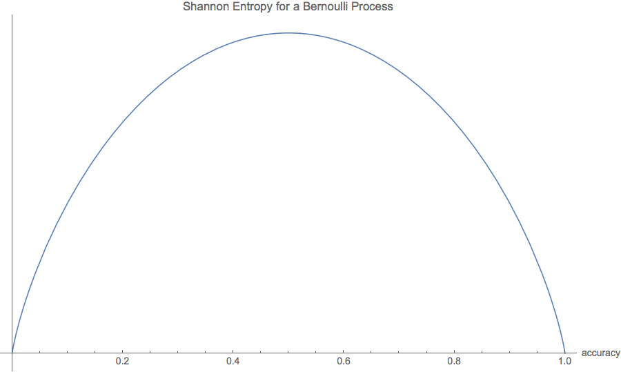

# Decisions, not predictions

This concept explains the "in business" component of this repository. I am emphasizing one of the roles of data science in business - to help make better decisions. The part in data science that is science, predicting, is a means to the business goal - deciding.

But this idea is not just organizational, if you will, it is actually reflected in the mathematics of how to use ground truth inference algorithms. Since your job is not to come with the best predictions, you can use methods that lead to the best decisions. And precision is what matters for decision, not accuracy!

There are two horses in a race. You can predict their racing times. What matters in that prediction is that you get the winner right, not that you predict the winner's time accurately. Decisions, not predictions.
## Understanding Shannon's entropy
Here is another example of the difference between decision and prediction. Which would you rather have, a 20% accurate binary classifier or a 70% one? If you understand the difference between decision and prediction, you would pick the 20% one. Let me make it clearer for you. Which is best, a 0% accurate classifier or a 70% one? Would thinking about the Seinfeld episode - "The Opposite" - help you decide?

The 0% classifier is more precise, the 70% one is more accurate. But algorithms can be wrapped in other algorithms. Take the 0% one and wrap it inside one that inverts its output.