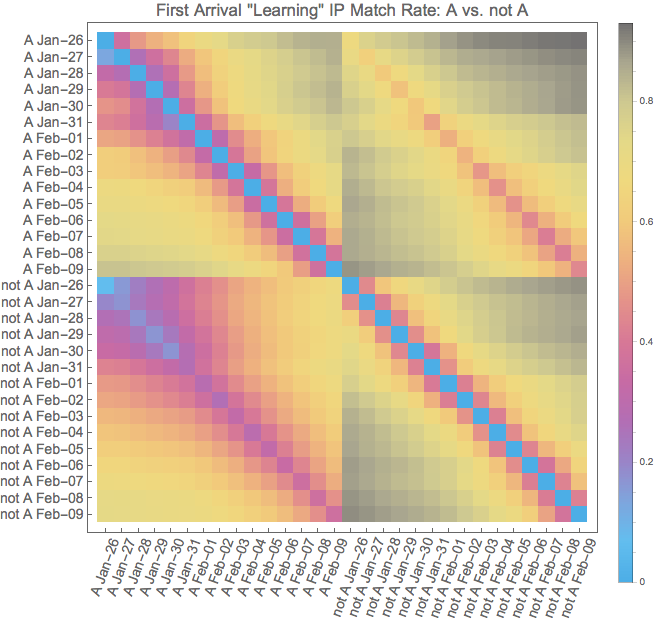

# When ground truth is expensive - data stream algorithms
Here you will find work I have done with HyperLogLog, a well-known data stream algorithm. Streaming algorithms are usually not thought off in the context of ground truth inference. But I see some similarities. In this case, data stream algorithms are ground truth statistic computations that refuse to remember the ground truth. A nice side-effect of that forgetting of ground truth is that they become private. So the measurements I describe here that look at the dynamics of IPs in a huge ad-network over a two-week period could easily be used in GDPR countries that consider IPs private data.

The figure above is a measurement I carried out to measure time constants for data flows between two parts of a company's ad-network. It would have been impossible to carry out this work using formally correct SQL queries of the company's database. Instead, I used HyperLogLog to take hourly sketches of the IP uniques in different data sources. The plot above was done in a series post-processing steps that computed union and intersection counts for all the sketches I had created. The rest of this README explains how I did it in more detail. Spoiler - not A is a better data source.