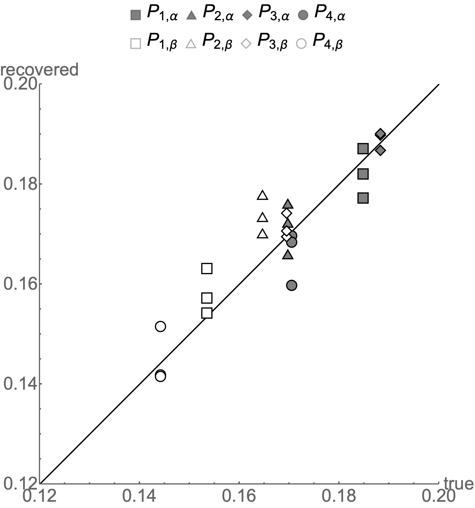

# ICML 2021 Submission Paper and Final Reviews

This folder contains the submission for the International Conference
in Machine Learning (ICML) 2021. The paper explains how algebraic
ground truth inference (algebraic GTI) can be used to measure the
performance of binary classifiers that are hovering near error independence
for the sample without any probability theory about the phenomena the
AI agents judged.

The final reviews are a tale themselves. We fully agree with most of the criticisms of reviewer \#2. She/he is clearly an expert in the mathematics
underlying algebraic GTI - algebraic geometry. This in an honest, critical
review. I cannot say the same thing about the other three reviewers. They
clearly did not understand the math behind the paper and seem, all three,
to suffer from the 
[Kunning-Drugger Effect](https://en.wikipedia.org/wiki/Dunning%E2%80%93Kruger_effect).

To support that opinion, consider the universal criticism of the three
sub-standard reviewers that "this only works binary classification"!
They clearly did not understand the math and missed that this exact same
algebraic approach can be applied to any classification task with a finite
number of labels. But besides being a huge misconception of the generality
of this technique, it also reveals something that all of us as researchers
complain about - the hypocrisy of scientific criticism and many reviews.

Here this hypocrisy manifests itself with the "it does not solve everything"
criticism. You know, like linear regression can "only solve linear problems"!
What scientific criteria requires that any new innovation solve its domain
problem space completely and unequivocally? To complain that a technique can
only solve certain problems is theoretical hypocrisy at its best.

This paper completes a cycle of three papers I have written by myself and with
others during this pandemic year. All three (NIPS 2020, AISTATS 2021 and ICML 2021) were rejected. These rejections have greatly improved the idea in spite
of universally bad reviewers (NIPS 2020 was the worst). Personal correspondence
with Boaz Nadler and others, plus reviewer \#2 on this paper, have helped
me place this work better in relation to that of others.

After the NIPS 2020 rejection, I resolved to move on to other conferences and
not repeat the papers but continue evolving the idea and finding new results.
That resolution has paid off. It is clear that ML conferences are not the venue
were this work will be accepted. So a manuscript submission for the SIAM journal of Mathematics Of Data Science is next. You can find some of the Mathematica notebook supplements that allow you to reproduce the results
in the paper [here](../SIMODS).