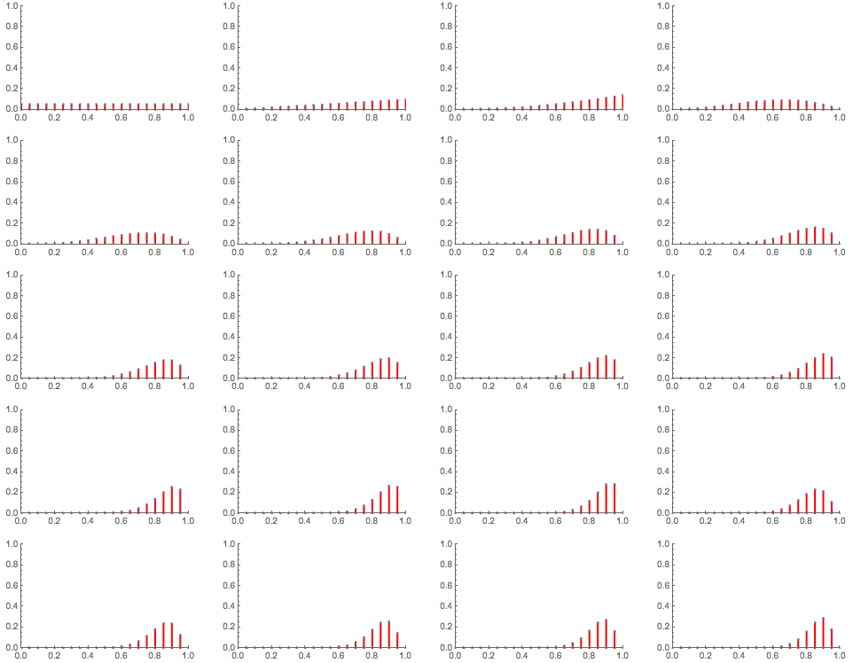
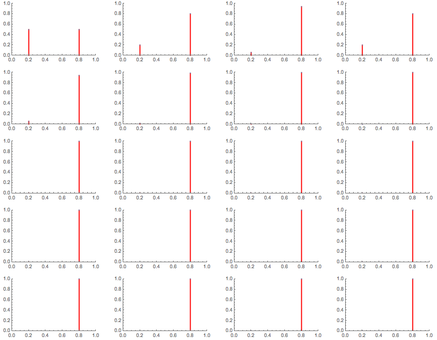

# Accuracy is cheap, precision expensive
One common feature of the ground truth inference algorithms for errors is that they measure precision error only. Two examples
* Ground truth inference for regressors is invariant to a global shift in all the predicted values.
* Ground truth inference for binary classifiers has a quadratic equation for the unknown prevalence. Because of this your classifiers could be 80% accurate or 20%. You are very precise about those two very different numbers!

The above examples instinctively cause many people to recoil. "Well, then, if you cannot tell me if my classifier is 80% or 20% accurate - how good is this?" Fair enough. Come join me in a little industrial tale.

The point of this tale is going to be that knowing 80% and 20% are the only two possible answers leads to a huge efficiency in calibrating the system - accuracy is cheap, precision expensive.

There are only two "states of knowledge" to consider.
1. You don't anything about the accuracy of a binary classifier.
2. You know that it is either 20 or 80 per cent accurate.

In state 1, your prior belief about what the correct accuracy is would look like the figure below - flat from 0 to 100 per cent.

In state 2, your prior belief about the correct accuracy are two thin peaks (about 2% wide in our current version) centered at 20 and 80 percent.

Suppose the correct answer for the accuracy of the classifier is 80%. How would you find this out? You would curate the data the classifier labeled and update your beliefs about what is the correct accuracy, a classic Bayesian updating scenario. But before I show you how much faster state 2 becomes certain of the right accuracy, let me point out that right off the bat state 2 has 50% in the right answer! State 1 thinks this is the correct answer with 5% certainty. In other words, it is not a fair fight. State 2 already a head start. So if you don't want to bother with the math below, this simple point should make it clear why state 2 is far better than state 1.

Let's consider now a hypothetical QA process. I have a bunch of samples of, say, label A data. And I want to figure out its accuracy on labeling it as such. You can imagine that by sequentially feeding the classifier my A samples and seeing how it classifies it (A or B), I will be able to figure out what is the correct accuracy for the classifier. I'll spare you the math for now. It is a straight forward application of Bayes Theorem where I use each successive decision of the classifier to update my beliefs about its true accuracy (the ground truth).

Instead I'll show you graphically what happens. Notice how dramatically different the two situations are. First I'll show what happens when you are in state 1 - no knowledge of the true accuracy. After curating 20 samples the certainty that 80% is the right answer is about 20%. It takes 197 samples to get to state 2's starting point, 50%! And 800 samples to get to the 99% state 2 achieves after 8 samples on average.

For exactly the same sequence of corrects and wrongs as the above sequence, this is what happens when you are in state 2. Accuracy is cheap, precision is expensive! I told you it was not a fair fight to begin with.

## A fairer fight between precision and accuracy
My current record is about 1% bounds on the accuracy of a binary classifier for MNIST or the HIGGS datasets. At that level of resolution for the estimate of the accuracy, you would have to compare ground truth inference to the uninformed prior with 51 equally spaced values. When you do that, you find that it takes 5000 updates, on average, for the uninformed prior to reach near certainty that 80% is the right value with 1% error margins.

It takes the ground truth method eight updates to do the same. That is an enormous savings in updating steps, a 1-8/5000 = 99.8% reduction in calibration costs.

