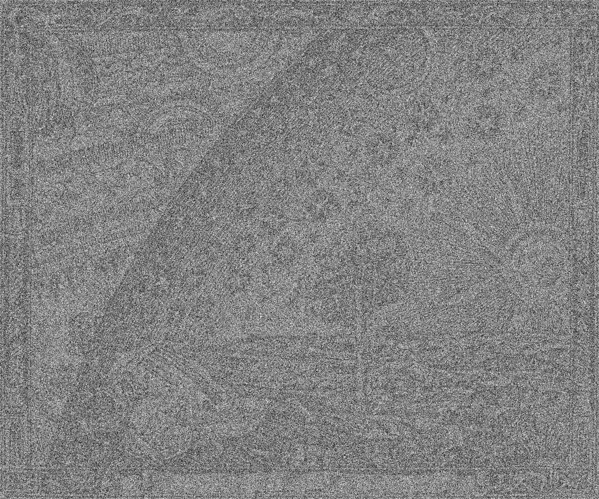
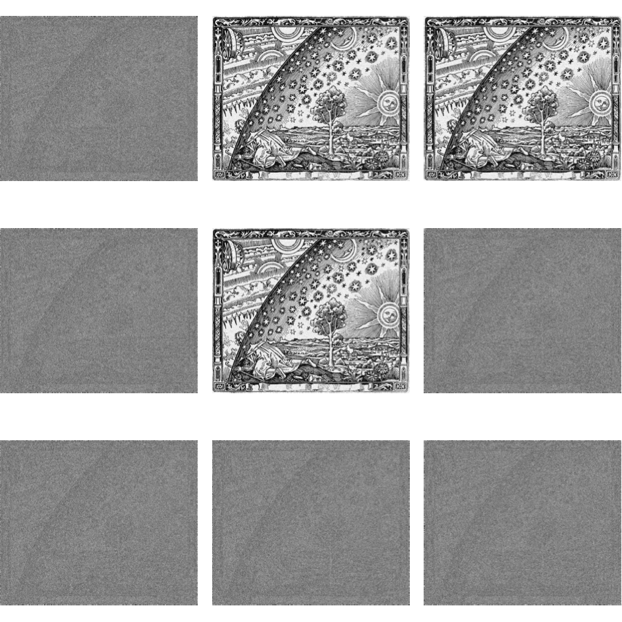
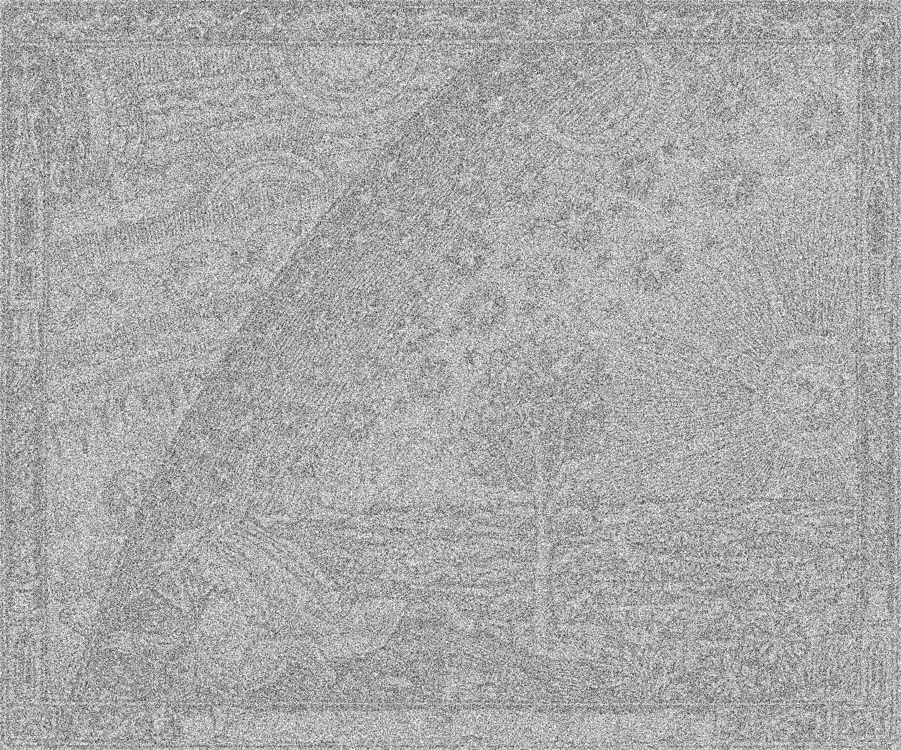
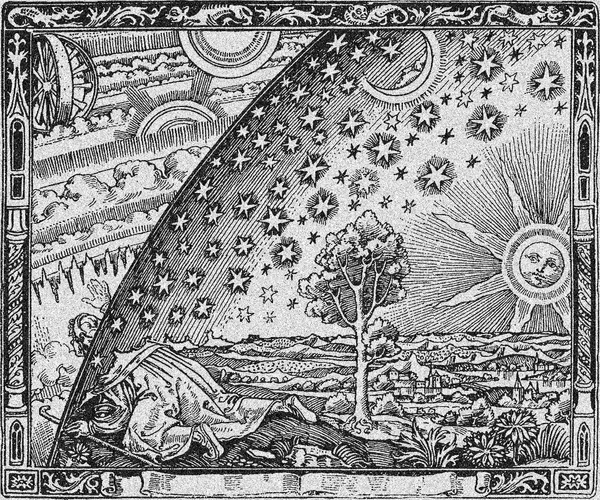
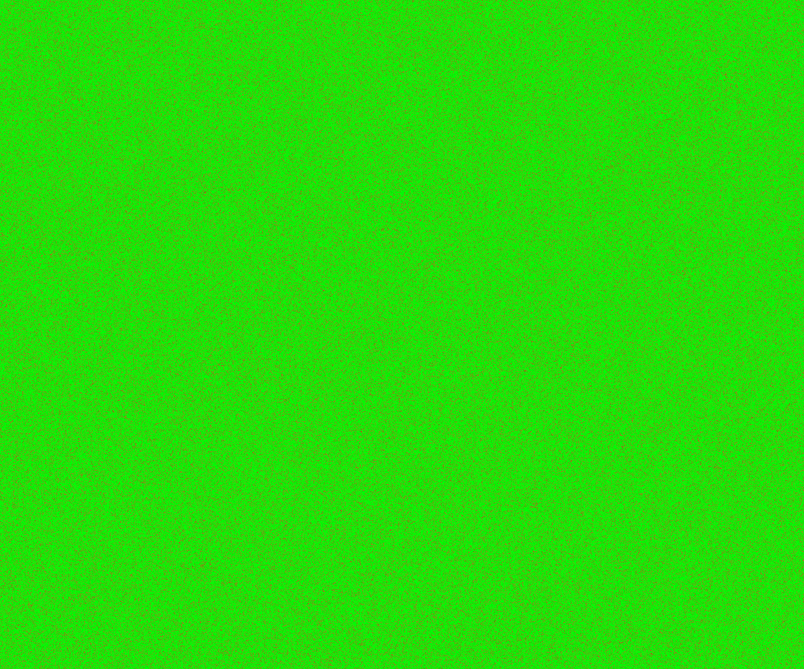
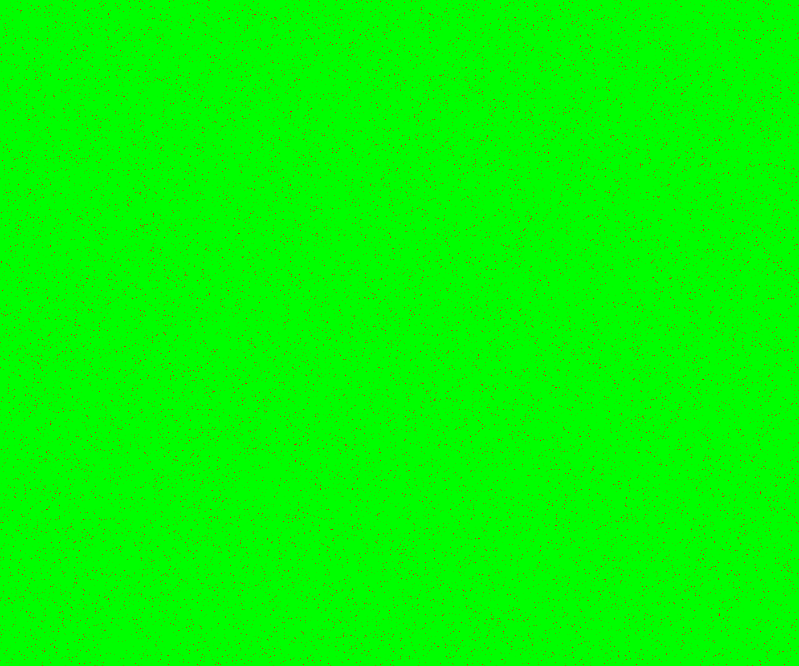
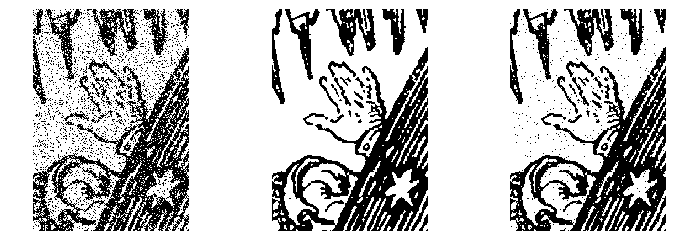

# Visual demonstration of the value of ground truth inference
If cameras can auto-focus and computers bit error correct, why can't AI algorithms auto-focus and error correct? I've been asking myself and others this question for the past three months. The answer seems historical at this this point since the problem of solving for correlated binary classifiers was solved in December 2017. At the beginning this analogy of auto-focusing and ground truth inference seemed somewhat metaphorical. Not entirely because autonomous precision mapping from aerial images is a form of auto-focus. 

But now I'm preparing for my May talk and thought it would be nice to demonstrate, visually, the value of knowing something as simple as the statistic of a classifiers acurracy. And, fittingly, the demonstration will be with a binarized form of the Flammarion engraving. This binarized form has, by construction, only two types of pixels - black and white. Here it is.

This now represents ground truth for our binary task. We will know simulate having errorful classifiers that attempt to recognize each pixel of this image and classify it as 1 or 0. Here is a classifier that is barely above breaking even for both labels (0 or 1).

You can sort of see the image still there, but barely. Here is an ensemble of 9 classifiers. Six of them are like the one above, barely breaking even. Three are almost perfect at 95% accuracy.

It is a testament to the strength of the wisdom of the crowd algorithm that when you apply it to the worst 6 classifiers you get a recognizable ghost of the original image.

Wisdom of the crowd on the full 9 classifiers is even better.

But if you knew that three of them are better, you could just apply wisdom of the crowd to those three to get -

You can see that the improvement is incremental, but still noticeable. We can create an error mask to highlight the errors in each ensemble group. Green is correct, red incorrect. This is the error mask for wisdom of the crowd applied to all nine.

The error mask for the best three is greener.

And the tallies of correct and error pixels says it even more dramatically
|  wisdom of the crowd group | # correct   | # incorrect  |
|---|---|---|
|  all 9 |  6,512,651 |  987,349 |
|  best 3 | 7,379,657  | 120,343  |

Here is the value of knowing which are your best classifiers - a reduction of (987,349-120,343)/987,349 = 88% in your errors! 

And finally, a trio of images to point out the difference. We zoom in on the hand of the explorer. Left image is wisdom of the crowd with all 9, the middle is ground truth, and the right is best three as detected by their average accuracy.
